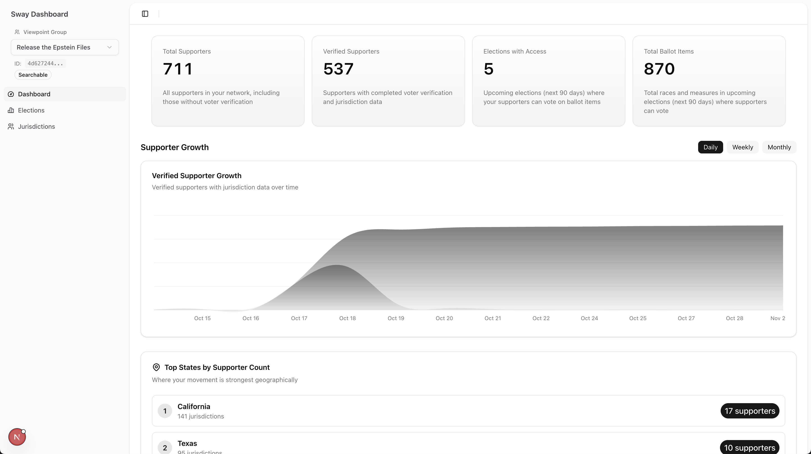
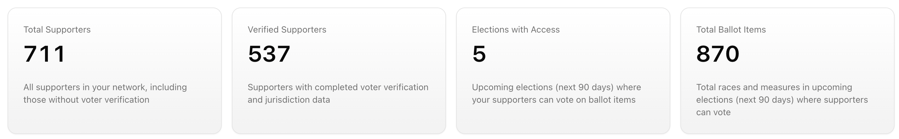
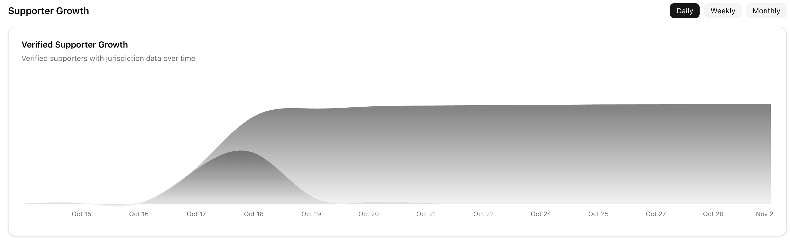
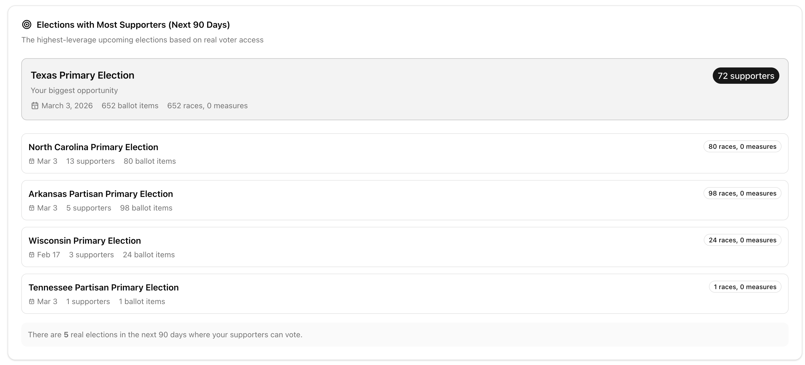
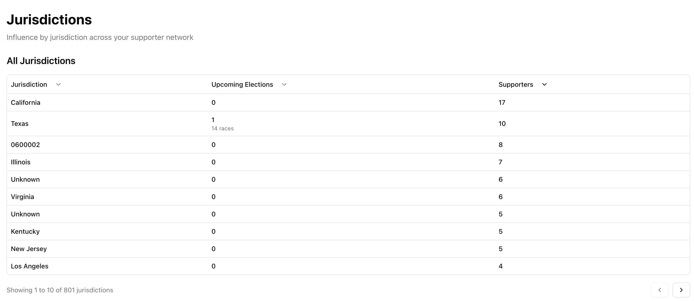

# Dashboard Documentation

https://github.com/ephraim888sun/sway-dashboard

## Overview

The Sway Dashboard provides a comprehensive view of supporter influence, electoral opportunities, and geographic distribution across jurisdictions and elections. It enables leaders to identify actionable opportunities where their verified supporters can make an impact in upcoming elections.

### Key Value Propositions

- **Real Voter Access**: Only counts verified supporters with jurisdiction data, ensuring metrics reflect actual voting capability
- **Actionable Timeframes**: Focuses on elections within the next 90 days, providing a realistic window for engagement
- **Geographic Intelligence**: Identifies where supporter concentration aligns with electoral opportunities
- **Performance Optimized**: Uses materialized views and intelligent caching for fast, responsive queries

*Main dashboard view showing summary metrics, supporter growth chart, top states, and election insights*

---

## Metrics Calculation

The dashboard calculates several key metrics to provide actionable insights into supporter influence and electoral opportunities.

### Total Supporters

Counts all supporters in the viewpoint group network, including those without voter verification. This provides a baseline understanding of the total supporter base.

**Calculation**: Aggregates all `profile_viewpoint_group_rels` records where `type = 'supporter'` across the viewpoint group network.

### Verified Supporters

Counts only supporters who have completed voter verification and have associated jurisdiction data. This metric represents supporters who can actually vote in elections.

**Calculation**: Joins `profile_viewpoint_group_rels` with `voter_verifications` and `voter_verification_jurisdiction_rels` to count supporters with verified voting capability.

### Elections with Access

Counts upcoming elections (within 90 days) where verified supporters have jurisdiction-based access to vote on ballot items.

**Calculation**: 
1. Identifies elections with `poll_date >= CURRENT_DATE` and `poll_date <= CURRENT_DATE + 90 days`
2. Matches ballot items in those elections to jurisdictions where supporters are verified
3. Counts elections where `supportersInScope > 0`

### Total Ballot Items

Sums all races and measures in upcoming elections (next 90 days) where supporters have jurisdiction-based access.

**Calculation**: Aggregates `ballot_items` count from elections where supporters have access.

### State Distribution

Geographic breakdown showing supporter counts and jurisdiction counts by state, sorted by supporter count.

**Metrics**:
- `supporterCount`: Total verified supporters in the state
- `jurisdictionCount`: Number of jurisdictions with supporters in the state

**Calculation**: Groups supporters by state through jurisdiction relationships, aggregates counts.

---

## Visualization Strategies

The dashboard employs multiple visualization techniques to make data accessible and actionable.

### Summary Cards

A responsive grid layout displaying the four key metrics: Total Supporters, Verified Supporters, Elections with Access, and Total Ballot Items.

### Time Series Charts

Interactive area charts showing supporter growth trends with dual metrics overlay.

*Supporter growth chart showing daily, weekly, and monthly trends*

### State Distribution

Ranked list visualization showing top states by supporter count with contextual information.

**Features**:
- Ranked list (top 10) with numbered badges
- Percentage calculation showing concentration (e.g., "Top 2 states represent X% of base")

### Election Insights

Highlights the top election opportunity with detailed breakdown, followed by a ranked list of other elections.

**Features**:
- **Actionable Details**: Poll date, supporter count, ballot item breakdown
- **Ranked List**: Secondary elections with key metrics

*Top election opportunities with supporter access metrics*

### Jurisdiction Table

Sortable, paginated data table for detailed jurisdiction analysis.

*Sortable jurisdiction table with supporter and election metrics*

---

## Actionable Insights

The dashboard is designed to surface insights that leaders can act upon immediately. Here's what makes an insight "actionable":

### Real Voter Access

Only verified supporters with jurisdiction data are counted in influence metrics.

### Actionable Timeframes

 Focus on elections within the next 90 days.

### Top Opportunities

**Principle**: Highlight elections with the most supporters in scope.

**Rationale**: Elections with more supporters represent higher-leverage opportunities where engagement efforts can have maximum impact.

### Geographic Concentration

**Principle**: Identify states and jurisdictions with highest supporter density relative to opportunities.

**Rationale**: Concentrated supporter bases in jurisdictions with upcoming elections represent the most efficient use of engagement resources.

## Technical Stack

- **Frontend**: Next.js 14 (App Router), React, TypeScript
- **Styling**: Tailwind CSS, shadcn/ui components
- **Charts**: Recharts
- **Data Fetching**: SWR (stale-while-revalidate)
- **Database**: Supabase (PostgreSQL)
- **State Management**: React Context API
- **Table**: TanStack Table (React Table)

---

## Part 3: Future Evolution

### Shortcuts, Simplifications, and Assumptions

#### Hardcoded Configuration Values

- **90-Day Election Window**: The timeframe for "upcoming elections" is hardcoded to 90 days throughout the application. This was chosen as a reasonable balance between actionable opportunities and data volume, but limits flexibility for different use cases.

- **Leader Viewpoint Group ID**: The primary leader's viewpoint group ID is focused solely on (`LEADER_VIEWPOINT_GROUP_ID`).

#### Client-Side Query Architecture

- **No API Routes**: All database queries run client-side using the Supabase client library. This eliminates API route overhead and enables real-time updates, but transfers query complexity and data processing to the browser.

- **Direct Database Access**: Queries bypass a server-side caching layer, meaning every page load triggers fresh database queries. This ensures data freshness but increases load times and database load.

#### Materialized View Refresh Strategy

- **Manual Refresh**: Materialized views require manual refresh via SQL functions. While refresh scripts exist, there's no automated scheduling (no pg_cron, Edge Functions, or external cron jobs configured).

- **Refresh Timing**: Views are refreshed on-demand rather than on a schedule, which can lead to stale data if not refreshed regularly.

#### Network Expansion Limitations

- **One-Level Depth**: Viewpoint group network expansion only goes one level deep: primary group → supporters → their leader groups. This doesn't handle deeper hierarchies or complex multi-level networks.

- **Sequential Processing**: Network expansion processes supporter profile IDs in batches sequentially, which can be slow for large supporter bases.

#### Query Batching Constraints

- **Fixed Batch Size**: Supabase `.in()` queries are limited to 100 items per batch. Large queries require multiple sequential batch operations, increasing latency.

- **No Query Result Caching**: First-time queries always hit the database, with no server-side result caching to speed up subsequent requests.

#### Time Series Data Processing

- **Client-Side Fallback**: Daily time series data falls back to client-side calculation when materialized views don't contain daily data. This involves fetching all supporter records and aggregating in JavaScript, which is memory-intensive.

### Scaling Concerns: What Breaks at 100k Supporters or 100k Leaders?

Several components would break or require significant redesign at scale:

#### Network Expansion Queries

**Current Behavior**: For a leader with 100k supporters, network expansion would:
- Fetch 100k supporter profile IDs
- Execute 1,000 sequential batch queries (100 items each) to find leader groups
- Potentially return thousands of viewpoint groups
- Block other queries until completion

**Impact**: Initial page load could take 30+ seconds, with hundreds of sequential database round-trips. Not Scalable

**Solution**: Compute data intensive resources on a separate server rather than in the frontend - either from a backend server with caching or computation on the database level.

#### Batch Processing Overhead

**Current Behavior**: Large queries (jurisdictions, ballot items) are processed in batches of 100, requiring sequential round-trips.

**Impact**: With 10,000+ jurisdictions, jurisdiction detail fetching alone requires 100+ sequential queries, adding significant latency.

**Solution**: Use PostgreSQL array operations or bulk queries to fetch all data in fewer round-trips.

#### Client-Side Memory and Processing

**Current Behavior**: Time series calculations, supporter deduplication, and aggregations happen in browser JavaScript.

**Impact**: 
- Browser memory exhaustion with large datasets
- UI freezing during heavy computations
- Poor performance on mobile devices

**Solution**: Move aggregations to server-side API routes or database functions. Note - was having trouble in this project to properly service the corresponding data. I had some data config issue - so decided to move form this.

#### Materialized View Refresh Times

**Current Behavior**: Materialized views refresh all data from scratch, scanning millions of rows.

**Impact**: 
- Refresh times increase from minutes to hours
- Concurrent refresh operations could lock tables
- Stale data periods become longer

**Solution**: Implement incremental refresh strategies, partition materialized views, or use streaming updates.

#### Network Transfer Bottlenecks

**Current Behavior**: Large JSON payloads (supporters by jurisdiction, time series data) transferred over network on every page load.

**Impact**: 
- Slow initial page loads (10+ seconds for large datasets)
- High bandwidth costs
- Poor mobile experience

**Solution**: Implement pagination, data compression, or progressive loading strategies.

### New Capabilities at Scale

At scale, new capabilities would unlock additional value:

#### Cross-Leader Analytics

- **Comparative Analysis**: Compare supporter growth, engagement rates, and electoral opportunities across multiple leaders or viewpoint groups.

- **Network Effects**: Analyze how supporter networks overlap and influence each other.

- **Best Practices**: Identify leaders with highest engagement rates and surface their strategies.

#### Predictive Modeling

- **Election Outcome Prediction**: Use historical data and supporter engagement patterns to predict election outcomes.

- **Engagement Forecasting**: Predict supporter growth and engagement trends.

- **Opportunity Scoring**: ML-based scoring of electoral opportunities based on supporter concentration, historical turnout, and other factors.

#### Real-Time Updates

- **Live Supporter Counts**: Real-time updates as supporters join or verify.

- **Election Alerts**: Push notifications for new elections matching supporter jurisdictions.

- **Engagement Tracking**: Real-time tracking of supporter engagement with campaigns.

#### Advanced Caching Strategies

- **Redis Layer**: Server-side caching layer for frequently accessed queries.

- **CDN Caching**: Cache static or semi-static data at edge locations.

- **Query Result Caching**: Cache expensive query results with smart invalidation.

- **Incremental Updates**: Only refresh changed data rather than full materialized views.

### What to Build Next

Priority order for next development:

#### 1. API Routes for Server-Side Processing

**Why**: Move heavy computations off the client, reduce network transfer, and enable better caching.

**Implementation**: Create Next.js API routes that handle network expansion, time series aggregation, and jurisdiction queries server-side.

**Impact**: Dramatically improves initial page load times and enables scaling to larger datasets.

#### 2. Automated Materialized View Refresh

**Why**: Ensure data freshness without manual intervention.

**Implementation**: Set up pg_cron, Supabase Edge Functions, or external cron jobs to refresh views every 15-30 minutes.

**Impact**: Eliminates stale data issues and reduces operational overhead.

#### 4. Incremental Data Loading

**Why**: Improve perceived performance and reduce initial load times.

**Implementation**: Load critical metrics first, then progressively load detailed data (jurisdictions, elections) as user scrolls or interacts.

**Impact**: Faster time-to-interactive, better mobile experience.

#### 5. Query Result Caching

**Why**: Speed up subsequent page loads and reduce database load.

**Implementation**: Add Redis or in-memory caching layer for expensive queries with smart invalidation based on data freshness requirements.

**Impact**: Near-instant page loads for cached queries, reduced database load.

#### 6. Pagination and Virtualization

**Why**: Handle large datasets without overwhelming the browser.

**Implementation**: Paginate jurisdiction tables, virtualize long lists, and implement infinite scroll where appropriate.

**Impact**: Smooth performance even with 100k+ records.

---

## Technical Decisions

This section documents the key technical tradeoffs made during implementation.

### Client-Side vs Server-Side Queries

**Decision**: All queries run client-side using Supabase client library.

**Main Problem**: I had some difficulty trying to utilize server side with Supabase, but didn't get it to work properly. Ended up just using frontend but at the sacrifice of speed.

**Tradeoffs**:
- ✅ **Pros**: Real-time updates, no API route overhead, direct database access with RLS policies, simpler architecture
- ❌ **Cons**: Query complexity in browser, large data transfers, no server-side caching, browser performance limitations

**Rationale**: For MVP, client-side queries provided faster development and real-time capabilities. At scale, server-side API routes would be necessary for performance.

**Future**: Migrate heavy queries to API routes while keeping lightweight queries client-side.

### Materialized Views vs Real-Time Queries

**Decision**: Use materialized views for expensive aggregations, refreshed periodically.

**Tradeoffs**:
- ✅ **Pros**: Dramatically faster queries (100x+), reduced database load, enables complex aggregations
- ❌ **Cons**: Stale data (15-30 min delay), refresh overhead, storage requirements

**Rationale**: Materialized views were essential for query performance with current data volumes. The tradeoff of slightly stale data was acceptable for dashboard metrics.

**Future**: Implement incremental refresh and more frequent updates for critical metrics.

### Batch Processing Strategy

**Decision**: Process large queries in batches of 100 items to respect Supabase `.in()` limits.

**Tradeoffs**:
- ✅ **Pros**: Works within Supabase constraints, handles large datasets
- ❌ **Cons**: Sequential round-trips add latency, complex error handling, potential for partial failures

**Rationale**: Batch processing was necessary to work within Supabase's query limits. The sequential approach was simpler than parallel batches with coordination.

**Future**: Use PostgreSQL array operations or bulk queries to reduce round-trips.

### SWR Caching Strategy

**Decision**: Use SWR with `revalidateOnFocus: false`, `revalidateOnMount: true`, `keepPreviousData: true`.

**Tradeoffs**:
- ✅ **Pros**: Fast subsequent loads, smooth transitions when switching viewpoint groups, background revalidation
- ❌ **Cons**: First load always hits database, no server-side caching, cache invalidation complexity

**Rationale**: SWR provides good UX with minimal configuration. The caching helps with perceived performance but doesn't solve initial load times.

**Future**: Add server-side caching layer above SWR for even better performance.

### Parallel Data Fetching

**Decision**: Fetch multiple data sources in parallel using `Promise.all()` for summary metrics.

**Tradeoffs**:
- ✅ **Pros**: Faster overall load time, better resource utilization
- ❌ **Cons**: All queries must complete before rendering, potential for waterfall effects if one query is slow

**Rationale**: Parallel fetching reduces total load time compared to sequential queries. However, the slowest query determines when data appears.

**Future**: Implement progressive loading where fast queries render immediately and slow queries update as they complete.

### Viewpoint Group Network Expansion

**Decision**: Expand networks one level deep (primary group → supporters → their leader groups).

**Tradeoffs**:
- ✅ **Pros**: Simple implementation, covers common use case, manageable query complexity
- ❌ **Cons**: Doesn't handle deeper hierarchies, misses complex network relationships

**Rationale**: One-level expansion covers the primary use case (leaders seeing their direct network) without the complexity of recursive expansion.

**Future**: Implement recursive CTE-based expansion for full network trees.